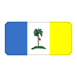
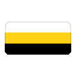
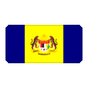
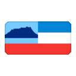
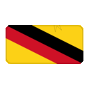
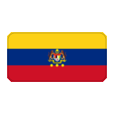

# Malaysia State Flags

Download-ready SVG flags and social-sized icons for Malaysia's 13 states, three federal territories, and the collective Federal Territories flag. This is an unofficial, community-maintained collection designed for easy reuse in websites, applications, artwork, and compatible sticker workflows.

**[Browse and download the collection on GitHub Pages](https://trtshen.github.io/Malaysia-State-Flags/)**

## Flags

Click a flag for its SVG source, or use the PNG and WebP links below it.

<!-- GALLERY:START -->
<table>
<tr><td align="center" width="25%"><a href="assets/svg/johor.svg"><br><strong>Johor</strong></a><br><a href="assets/png/faithful/128/johor.png">PNG</a> · <a href="platforms/whatsapp/stickers/johor.webp">WebP</a></td><td align="center" width="25%"><a href="assets/svg/kedah.svg"><br><strong>Kedah</strong></a><br><a href="assets/png/faithful/128/kedah.png">PNG</a> · <a href="platforms/whatsapp/stickers/kedah.webp">WebP</a></td><td align="center" width="25%"><a href="assets/svg/kelantan.svg"><br><strong>Kelantan</strong></a><br><a href="assets/png/faithful/128/kelantan.png">PNG</a> · <a href="platforms/whatsapp/stickers/kelantan.webp">WebP</a></td><td align="center" width="25%"><a href="assets/svg/kuala-lumpur.svg"><br><strong>Kuala Lumpur</strong></a><br><a href="assets/png/faithful/128/kuala-lumpur.png">PNG</a> · <a href="platforms/whatsapp/stickers/kuala-lumpur.webp">WebP</a></td></tr>
<tr><td align="center" width="25%"><a href="assets/svg/labuan.svg"><br><strong>Labuan</strong></a><br><a href="assets/png/faithful/128/labuan.png">PNG</a> · <a href="platforms/whatsapp/stickers/labuan.webp">WebP</a></td><td align="center" width="25%"><a href="assets/svg/malacca.svg"><br><strong>Malacca</strong><br><small>Melaka</small></a><br><a href="assets/png/faithful/128/malacca.png">PNG</a> · <a href="platforms/whatsapp/stickers/malacca.webp">WebP</a></td><td align="center" width="25%"><a href="assets/svg/negeri-sembilan.svg"><br><strong>Negeri Sembilan</strong></a><br><a href="assets/png/faithful/128/negeri-sembilan.png">PNG</a> · <a href="platforms/whatsapp/stickers/negeri-sembilan.webp">WebP</a></td><td align="center" width="25%"><a href="assets/svg/pahang.svg"><br><strong>Pahang</strong></a><br><a href="assets/png/faithful/128/pahang.png">PNG</a> · <a href="platforms/whatsapp/stickers/pahang.webp">WebP</a></td></tr>
<tr><td align="center" width="25%"><a href="assets/svg/penang.svg"><br><strong>Penang</strong><br><small>Pulau Pinang</small></a><br><a href="assets/png/faithful/128/penang.png">PNG</a> · <a href="platforms/whatsapp/stickers/penang.webp">WebP</a></td><td align="center" width="25%"><a href="assets/svg/perak.svg"><br><strong>Perak</strong></a><br><a href="assets/png/faithful/128/perak.png">PNG</a> · <a href="platforms/whatsapp/stickers/perak.webp">WebP</a></td><td align="center" width="25%"><a href="assets/svg/perlis.svg"><br><strong>Perlis</strong></a><br><a href="assets/png/faithful/128/perlis.png">PNG</a> · <a href="platforms/whatsapp/stickers/perlis.webp">WebP</a></td><td align="center" width="25%"><a href="assets/svg/putrajaya.svg"><br><strong>Putrajaya</strong></a><br><a href="assets/png/faithful/128/putrajaya.png">PNG</a> · <a href="platforms/whatsapp/stickers/putrajaya.webp">WebP</a></td></tr>
<tr><td align="center" width="25%"><a href="assets/svg/sabah.svg"><br><strong>Sabah</strong></a><br><a href="assets/png/faithful/128/sabah.png">PNG</a> · <a href="platforms/whatsapp/stickers/sabah.webp">WebP</a></td><td align="center" width="25%"><a href="assets/svg/sarawak.svg"><br><strong>Sarawak</strong></a><br><a href="assets/png/faithful/128/sarawak.png">PNG</a> · <a href="platforms/whatsapp/stickers/sarawak.webp">WebP</a></td><td align="center" width="25%"><a href="assets/svg/selangor.svg"><br><strong>Selangor</strong></a><br><a href="assets/png/faithful/128/selangor.png">PNG</a> · <a href="platforms/whatsapp/stickers/selangor.webp">WebP</a></td><td align="center" width="25%"><a href="assets/svg/terengganu.svg"><br><strong>Terengganu</strong></a><br><a href="assets/png/faithful/128/terengganu.png">PNG</a> · <a href="platforms/whatsapp/stickers/terengganu.webp">WebP</a></td></tr>
<tr><td align="center" width="25%"><a href="assets/svg/federal-territories.svg"><br><strong>Federal Territories</strong><br><small>Wilayah Persekutuan Malaysia</small></a><br><a href="assets/png/faithful/128/federal-territories.png">PNG</a> · <a href="platforms/whatsapp/stickers/federal-territories.webp">WebP</a></td><td align="center" width="25%"></td><td align="center" width="25%"></td><td align="center" width="25%"></td></tr>
</table>
<!-- GALLERY:END -->

## Use

Download or vendor the files you need. Raw GitHub URLs are convenient for testing but should not be treated as a production CDN.

```html

```

```css
.johor-flag {
  background: url("./assets/png/rounded/128/johor.png") center / contain no-repeat;
  width: 128px;
  height: 128px;
}
```

Available PNG sizes are `32`, `64`, `128`, `256`, and `512` pixels in both `faithful` and `rounded` styles. The WhatsApp directory contains 512×512 WebP artwork, a tray icon, and reference metadata; an Android or iOS sticker app is still required to install a pack.

Download a complete set from the latest release: [SVG sources](../../releases/latest/download/svg.zip), [PNG icons](../../releases/latest/download/icons.zip), or [WhatsApp artwork](../../releases/latest/download/whatsapp.zip).

## Repository map

- `assets/svg/` — canonical vector sources.
- `assets/png/` — generated faithful and rounded icons.
- `platforms/whatsapp/` — WhatsApp-ready artwork and metadata.
- `data/flags.json` — stable IDs, paths, provenance, and licensing source of truth.
- `scripts/` — dependency-free build, validation, documentation, QA, and release tools.

To rebuild locally, install Node.js 20+ and ImageMagick 7, then run `npm run build`, `npm run docs`, and `npm test`. Builds do not download remote assets.

To generate the static GitHub Pages catalogue, run `npm run site` and serve `output/site/` with any local static server. The site is generated from `data/flags.json`, uses relative asset paths, and has no runtime dependencies. The generator verifies source SVG checksums, rejects active or externally loaded SVG content, and validates all staged links before publishing. Publishing is handled by `.github/workflows/pages.yml`; GitHub Pages is configured to use GitHub Actions with HTTPS.

The deployment workflow installs no packages and uses only GitHub-owned actions pinned to immutable commit SHAs. `main` requires a pull request and the passing `validate` check; the `github-pages` environment accepts only protected branches. This keeps the repository practical for a solo maintainer without requiring a second reviewer.

## License and attribution

Project code and documentation use the [MIT License](LICENSE). Flag artwork retains its per-file upstream terms; generated derivatives remain subject to those terms. See [ATTRIBUTION.md](ATTRIBUTION.md) for every source, author, license, and modification.

Official-symbol rules can apply independently of copyright. This project is not affiliated with or endorsed by any Malaysian government body; read [LEGAL.md](LEGAL.md) before commercial, branding, or trademark use.

Corrections and well-sourced improvements are welcome. See [CONTRIBUTING.md](CONTRIBUTING.md).
